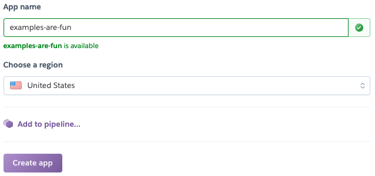
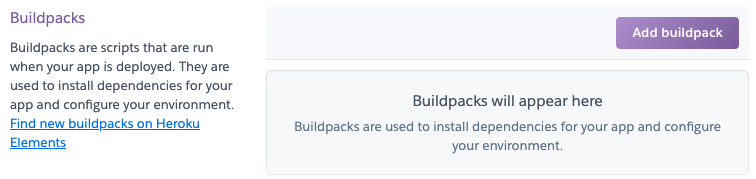
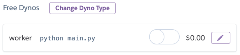
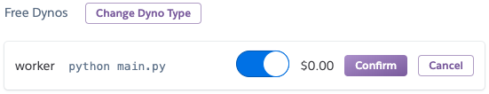
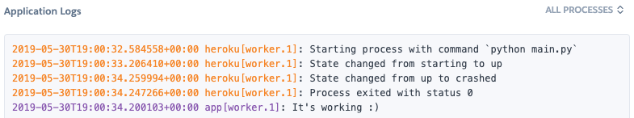
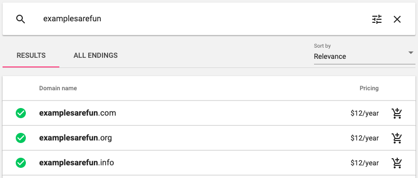
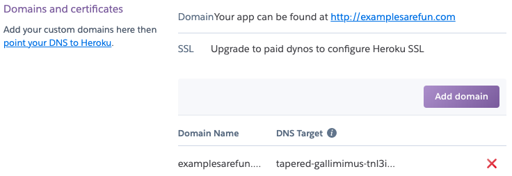
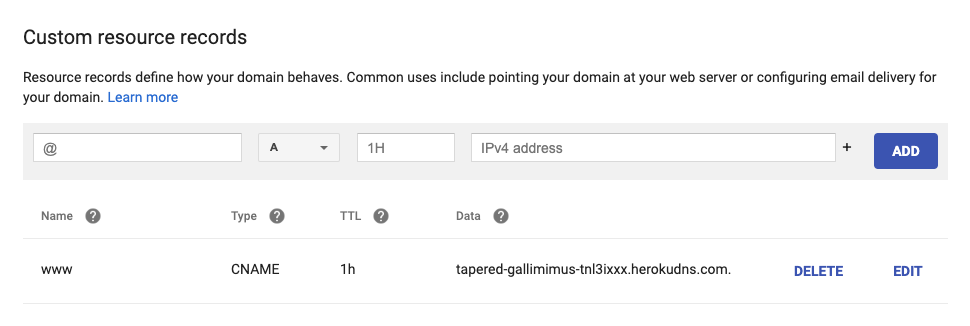
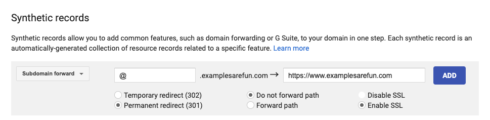

# Using a Google domain name with Heroku

| WARNING: This is gonna cost money. As of writing this a domain from google will probably cost you about \$12 per year. The cheapest paid tier for heroku costs \$7 / month. |
| --- |

### First create a new Heroku app
https://dashboard.heroku.com/new-app



### Add a buildpack to your Heroku app
https://dashboard.heroku.com/apps/examples-are-fun/settings



For the purposes of this walkthrough I picked python. You may not need to pick a buildpack if your app is set up in such a way that Heroku is able to infer what buildpack(s) you need. For example if Heroku sees that you have a `package.json` file it will infer that you need the `node` buildpack. If it sees a `requirements.txt` file it will infer that you need the `python` buildpack. In any case Heroku must know about at least one buildpack or any attempt to deploy will fail.

### Deploy your app to Heroku
Heroku requires a paid tier to allow for automated certificate management. But before we can upgrade to a paid tier we need to deploy something to heroku.

We will be using the command line to deploy our app to Heroku. If you haven't already installed the Heroku CLI (link) then first do that.
```bash
brew tap heroku/brew && brew install heroku
# Make sure to log in to heroku after you've installed the CLI
heroku login
```

Now let's initialize a new Git repository and deploy it!

```bash
mkdir examples-are-fun
cd examples-are-fun
# Initialize a new Git repository
git init
# Set our Heroku app as remote for our new Git repository
heroku git:remote -a examples-are-fun
# Add a super basic python script and Procfile
echo "print(\"It's working :)\")" > main.py
echo "worker: python main.py" > Procfile
# requirements.txt is not optional when using the python buildpack
touch requirements.txt
git add .
git commit -m "Initial commit"
# Deploy it!
git push heroku master
```

You should now see your worker under the Heroku resources tab for your app.
https://dashboard.heroku.com/apps/examples-are-fun/resources



Click the `edit` icon and toggle that worker to on! Make sure to click confirm.



Check to make sure everything worked by looking at the logs
https://dashboard.heroku.com/apps/examples-are-fun/logs



If the logs look ok then congratulations you've successfully deployed an app to Heroku!

### Purchase a domain from Google
https://domains.google.com/m/registrar/search

I used `examplesarefun.com`



### Add your Google domain to Heroku
https://dashboard.heroku.com/apps/examples-are-fun/settings



Heroku will generate a DNS target for you. Copy that DNS target to your clipboard. We're going to use that in our Google domain management dashboard in a minute.
WAIT TO DO THIS UNTIL HEROKU’s ACM STATUS IS OK (requires HOBBY TIER)

### Configure Google DNS Settings
https://domains.google.com/m/registrar/jamesbcollins.dev/dns



In theory this could take up to 48hrs before that redirect happens but in my experience it usually only takes a few minutes. You can check if it's working by running a `host` lookup.

```bash
host www.examplesarefun.com
```

If you care about supporting a "naked" URL
`examplesarefun.com` vs `www.examplesarefun.com`
You can do so now by adding a `Synthetic Record`


7. Add email forwarding here: https://domains.google.com/m/registrar/jamesbcollins.dev/email?hl=en